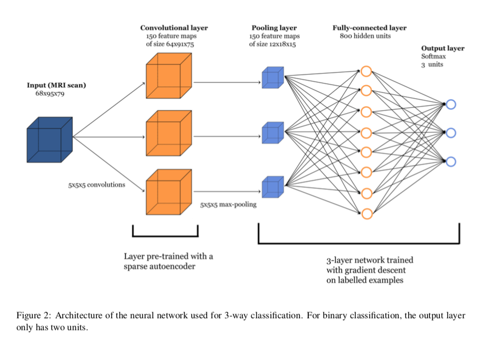

> [原文](https://arxiv.org/abs/1502.02506)

## 预测阿尔茨海默病:一项使用三维卷积神经网络的神经成像研究

> February 10，2015
>
> Abstract
>
> 利用神经影像学数据进行模式识别，用于阿尔茨海默病的诊断是近年来广泛研究的课题。在本文中，我们使用深度学习方法，特别是稀疏自编码器和三维卷积神经网络，建立了一种基于脑部MRI扫描的预测患者病情的算法。我们报告的实验使用ADNI数据集涉及2,265个历史扫描。我们证明了三维卷积神经网络优于其他文献中报道的分类器，并产生了最先进的结果。

### 1. INTRODUCTION（简介）

​	阿尔茨海默病(AD)是最常见的痴呆症类型。痴呆症是一种以记忆丧失或其他认知障碍为特征，由大脑神经细胞受损引起的疾病。在美国，2014年估计有520万各个年龄段的人患有AD。轻度认知障碍(MCI)是指一个人的思维能力发生轻微但明显的变化。有MCI的个体比没有[1]的个体更容易发展为AD。

​	早期发现这种疾病可以通过磁共振成像(MRI)来实现，这是一种利用磁场和无线电波来创建详细的大脑三维图像的技术。近年来，人们尝试了多种机器学习方法来完成这一任务，包括支持向量机、独立分量分析和惩罚回归。其中一些方法已被证明是非常有效的诊断AD从神经图像中，有时甚至比人类放射科医生更有效。例如，最近的研究表明，机器学习算法能够比经验丰富的临床医生更准确地**预测**AD。因此，发展和完善这类预测方法具有重要意义。

​	在本文中，我们建立了一个学习算法，使用MRI图像作为输入，能够区分健康的大脑(HC)和患病的大脑。我们研究了一类深度人工神经网络，特别是稀疏自编码器和卷积神经网络的组合。我们的方法的主要创新之处在于，在整个MRI图像上使用三维卷积，这在我们的实验中比二维卷积在切片上产生更好的性能。**我们报告了使用3路分类器(HC vs. AD vs. MCI)和3个二进制分类器(AD vs. HC, AD vs. MCI, MCI vs. HC)获得的分类结果。**

​	本文组织如下。我们在第2节中描述了数据，并在第3节中介绍了深度学习方法。第4节简要回顾了文献中针对这一问题所报道的不同分类方法。最后，在第5部分，我们给出了实验结果并进行了讨论。

### 2.EXPERIMENTAL DATA（实验数据）

​	在我们的实验中，我们使用了作为阿尔茨海默病神经成像计划(ADNI)一部分的MRI数据。ADNI是一项正在进行的多中心研究，旨在开发临床、影像学、遗传和生化生物标志物，用于早期发现和跟踪阿尔茨海默病。ADNI研究始于2004年，目前正处于第三阶段。这里使用的数据集最初是在[5]中准备和分析的，包括三个级别(AD、MCI、HC)中的每个级别的755名患者，总共进行了2,265次扫描。**使用统计参数映射(SPM)将图像数据规范化为国际脑映射模板联盟。**该配置包括一个没有加权图像的正电子密度模板和一个用于插值的7阶b样条，同时其余参数设置为默认值。**我们还通过减去平均值并除以标准差使数据正则化。**每幅图像的维数为 68 × 95 × 79，得到了 510,340 个体素。图1显示了从MRI扫描中提取的三个二维切片的示例。

> 数据预处理...

### 3. DEEP NEURAL NETWORKS（深度神经网络）

​	我们采用两阶段的方法，首先使用稀疏自编码器学习卷积运算的滤波器，然后构建卷积神经网络，其第一层使用自编码器学习的滤波器。在本文中，我们特别感兴趣的是比较二维和三维卷积网络的性能。3.1节给出了稀疏自编码器的结构，3.2节描述了三维卷积网络。第3.3节详细介绍了2D网络。

> 原文中这段的最后一句为：The 2D network is detailed in Section 3.2. 有误，二维网络应该是在3.3节中介绍的。

#### 3.1 Sparse Autoencoder（稀疏自编码器）

​	**自动编码器是一种3层神经网络，用于从输入中提取特征**，如图像[3]。 自动编码器具有输入层、隐藏层和输出层; 每层包含几个神经元。 输入层和输出层具有相同数量的神经元。 该网络具有**编码器函数** $$f$$ ，其将给定输入 $$x∈R^n$$ 映射到隐藏表示 $$h∈R^p$$，以及**解码器函数** $$g$$，其将表示 $$h$$ 映射到输出 $$\hat{x} ∈ R^n$$ 。 在我们的问题中，输入 $$x$$ 是从扫描中提取的3D补丁。 解码器功能的目的是从隐藏表示 $$h$$ 中重建输入 $$x$$。 设 $$W∈R^{p×n}$$ 和 $$b∈R^p$$ 分别为权重矩阵和编码器函数的偏差矢量; 类似地，令 $$W^*∈R^{n×p}$$和 $$b^*∈R^n$$ 分别是解码器函数的权重和偏差。自动编码器估计参数为：

$$
h = f(Wx+b)
$$

$$
\hat{x} = g(W^{*}h+b^{*})
$$

其中 $$f$$ 是 Sigmoid函数（sigmoid function），$$g$$ 是恒等函数（identity function）。 这里我们使用解码器的恒等函数，因为输入是实值的，而Sigmoid函数会将输出神经元约束在区间[0,1]内，并且会使重建将更加困难。 此外，我们施加绑定权重 $$W^* = W^T$$。 对于像素强度等实值输入，**代价函数合适的选择是均方误差**，即

$$
J(W,b) = \frac{1}{N}\sum_{i=1}^{N}\frac{1}{2}||\hat{x}^{(i)}-x^{(i)}||^2
$$

其中 $$N$$ 是输入的总数。自动编码器可用于通过其隐藏层获得输入数据的新表示。我们决定尝试使用具有过完备隐藏层的自动编码器，即具有**与输入神经元相等或更多数量的隐藏神经元的自动编码器**。具有过度完整隐藏层的自动编码器可以是有用的特征提取器。过度完备自动编码器的一个潜在问题是，如果我们只将重建误差最小化，那么隐藏层可能只是学习恒等函数。因此，我们需要施加额外的限制。在我们的实验中，我们使用具有稀疏性约束的自动编码器。**我们研究稀疏自动编码器，即通过强制大多数隐藏神经元接近于零而获得的自动编码器，是否可用于学习用于卷积运算的有用滤波器。**在这种情况下，稀疏性约束被认为是有利的，因为它鼓励表示可以解开控制MRI图像的可变性的潜在因素。

​	设 $$a_j(x)$$ 表示当自动编码器被赋予输入 $$x$$ 时隐藏神经元 $$j$$ 的激活，并设

$$
\hat{s}_j = \frac{1}{N}\sum_{i=1}^{N}[a_j(x^{(i)})]
$$

是隐藏神经元 $$j$$ 的平均激活，在训练集上进行平均。我们试图对所有 $$j$$ 施加约束 $$s_j = s$$，其中 $$s$$ 是**稀疏度超参数**，通常是接近零的小值（例如，$$s = 0.05$$）。为了满足这个约束，我们在代价函数中添加了一个惩罚项。 我们根据Kullback-Leibler分歧的概念选择惩罚：

$$ \sum_{j=1}^{h}KL(s||\hat{s}_j) $$

其中

$$ KL(s||\hat{s}_j) = slog(\frac{s}{\hat{s}_j})+(1-s)log(\frac{1-s}{1-\hat{s}_j}) $$  

量化一个了均值为$$s$$的伯努利分布与另一个均值为 $$\hat{s}_j$$ 伯努利分布之间的差异。总之，$$h$$是隐藏层中的神经元数，索引 $$j$$ 是对所有隐藏神经元进行求和。如果 $$s_{j}=s$$，则该惩罚具有 KL(s||sj)=0 的特性，否则随着 $$s_{j}$$ 远离 $$s$$ 而增加。因此，最小化该项具有使 $$s_j$$ 接近 $$s$$ 的功能。 我们在这里使用的代价函数是     

$$ J_2(W,b)=J(W,b)+\beta \sum_{j=1}^{h}KL(s||\hat{s}_j)+\lambda \sum_{i,j}W^2_{i,j} $$

其中 $$J(W,b)$$ 即先前的定义，而 $$β$$ 是**控制惩罚项权重的超参数**。 我们还在代价函数中添加了第三项，称为**重量衰减**，用于减少过度拟合；$$\lambda$$ 是**控制重量衰减量的超参数**。

​	在我们的方法中，我们在从MRI扫描中提取的一组随机选择的尺寸为5×5×5 = 125的三维补丁上训练自动编码器。 **这种自动编码器训练的目的是学习卷积运算的滤波器**：正如我们将在3.2节中解释的那样，卷积覆盖输入中的一系列空间局部区域。 总的来说，我们从训练集中的100次扫描中提取了1000个补丁，因此我们总共有10万个补丁。 我们训练一个稀疏的超完备自动编码器，在这组补丁上有150个隐藏神经元。我们为训练集使用80,000个补丁，为验证集使用10,000个补丁，为测试集使用10,000个补丁。将每个补丁展开到大小为125的向量中。

​	使用小批量（mini-batch）梯度下降最小化代价函数：训练集分为几个小批量，并且在每次迭代中我们仅使用这些小批量中的一个用于我们要最小化的函数中；预计该算法比完整批次的数据更快收敛。

​	我们还定义了一个将隐藏层中的一个神经元链接到输入层中的所有神经元的所有权重的集合的方法。 另一个方法将尝试在输入中提取空间局部化特征。 这些方法将用于卷积神经网络的下一部分。

> 稀疏自编码器可参考：[稀疏自编码器](https://baike.baidu.com/item/%E7%A8%80%E7%96%8F%E8%87%AA%E7%BC%96%E7%A0%81%E5%99%A8/22701775?fr=aladdin)

#### 3.2 3D Convolution Networks（三维卷积网络）

​	在训练稀疏自动编码器之后，我们构建了一个三维卷积网络，它将MRI扫描作为输入。研究发现，卷积网络对于诸如手写数字识别和对象识别等几个领域中的图像分类问题是有用的。

​	**这些人工神经网络由卷积层（convolutional）、池化层（pooling）和全连接层（fully-connected）组成。网络的特征取决于于三个主要属性：隐藏神经元的本地连接（local connectivity of the hidden units），参数共享（parameter sharing）和池化操作的使用（the use of pooling operations）。**

​	我们首先描述本地连接的概念。**在隐藏层中，神经元不连接到前一层中的所有神经元，而是仅连接到空间局部化区域中的少量神经元。**该属性在许多方面都是有益的。一方面，它减少了参数的数量，从而使架构不易过度拟合，同时还减轻了内存和计算问题。另一方面，通过对图像的部分进行建模，隐藏神经元能够检测对于辨别可能重要的局部图案和特征。隐藏神经元连接到的图像部分称为“**感受野**（receptive field）”。固定大小的每个可能的感受野与特定的隐藏神经元相关联。所有这些隐藏神经元的集合对应于单个“**特征映射**（feature map）”，即一组隐藏神经元，它们共同覆盖整个图像。

​	隐藏层具有多个特征映射，并且特征映射中的所有隐藏神经元共享相同的参数。 这种参数共享功能非常有用，因为它进一步减少了参数的数量，并且特征映射中的隐藏神经元在输入中的每个位置提取了相同的特征。

​	设 $$y^k$$ 是隐藏层中第 $$k$$ 个特征映射的三维数组，$$x$$ 是输入的三维数组。 另外，设 $$W_k$$ 为连接输入到第k个特征映射的三维滤波器，设 $$b_k$$ 为第k个特征映射的标量偏差项。 特征映射的计算由下式给出：

$$
y^k=f(W_k*x+b_k)
$$

其中 $$f$$ 是 Sigmoid激活函数，$$*$$ 表示卷积运算操作。在计算中，标量项$$b_{k}$$被添加到数组$$W_{k} * x$$的每个条目中。我们假设$$W_{k}$$的大小为$$r×s×t$$。 我们将输入 $$x$$ 的卷积定义为滤波器$$W_{k}$$为 $$[W_{k} * x](i,j,k)$$，即

$$
\sum_{u=0}^{r-1}\sum_{v=0}^{s-1}\sum_{w=0}^{t-1}W_k(r-u,s-v,t-w)x(i+u,j+v,k+w)
$$

其中 $$M(i,j,k)$$ 表示三维数组 $$M$$ 的 $$(i,j,k)$$ 条目。大小为 $$m×p×q$$ 的输入映射与大小为r×s×t的滤波器的卷积得到大小 $$(m-r + 1)×(p-s + 1)×(q-t + 1)$$ 的输出。

​	**由这种方式获得的几个特征映射组成的层称为卷积层。**

​	对于之前训练的稀疏自动编码器的每个方法（basis），我们使用该方法的学习权重集作为三维卷积层的三维滤波器。 通过将卷积应用于所有方法，我们获得了150个三维特征映射的卷积层。由于补丁大小为 5×5×5，因此基于图像的卷积产生尺寸为 (68-5 + 1)×(95-5 + 1)×(79-5 + 1)= 64×91×75 的特征映射。我们还添加与方法相关联的偏差项，并将Sigmoid激活函数应用于特征映射中的每个神经元。 该卷积层可能发现三维输入图像中的局部图案和结构：它允许算法利用图像的三维拓扑/空间信息。

​	**卷积层之后是池化层。 我们使用max-pooling**，它包括将每个特征映射分割成隐藏神经元的几个**非重叠和相邻邻域**。 在每个邻域内，仅保留具有最大激活（即最大值）的隐藏神经元。 池化操作减少了隐藏层中的神经元数量，如上所述，这是有用的。 池化还可以对图像的小变形（例如翻译）构建了稳健性。 在我们的方法中，我们应用 5×5×5 max-pooling操作来减小卷积层的特征映射的大小。因此，每个特征映射成为最大池特征映射，大小为（64/5）×（91/5）×（75/5）= 12×18×15，**其中我们向下舍入到最接近的整数，因为我们忽略了边界。**

​	然后堆叠每个最大池特征映射的输出。 利用150个尺寸为12×18×15的特征映射，总共有150×12×18×15 = 486,000个输出。 **这些输出用作3层全连接神经网络的输入（即具有输入，隐藏和输出层）。**我们选择具有800个具有Sigmoid激活功能的神经元的隐藏层，以及具有3个具有Softmax激活功能的神经元的输出层。 输出层中的3个神经元表示输入属于每个类（AD，MCI，HC）的条件概率。 图2提供了网络架构的图示。

​	

​	我们将**交叉熵**作为我们的代价函数$$J(W,b)$$，它通常用于分类任务。这个函数是：

$$
-\frac{1}{N}\sum_{i=1}^{N}\sum_{j=1}^{3}\left[1\{y^{(i)}=j\}log(h_{w,b}(x^{(i)})_j)\right]
$$

其中 $$N$$ 是MRI扫描的数量，$$j$$ 是3个类别的总和，$$h_{W,b}$$是网络计算的函数，$$x(i)$$，$$y(i)$$ 分别是第 $$i$$ 个扫描的输入值和标签值。我们**不使用重量衰减**，因为在早期实验中，未发现该项的添加是有益的。

​	**3层网络采用小批量（mini-batch）梯度下降进行训练**。**隐藏层的权重随机初始化**，**Softmax层的权重初始化为零**。 值得注意的是，我们在最终训练中不包括卷积层；卷积层仅用自动编码器“**预训练**（pre-trained）”。 我们还使用**动量方法（momentum method）**来加速3层网络的训练。 简而言之，该方法包括在梯度下降更新中添加过去梯度的加权平均值，以便去除一些噪声，特别是在代价函数的高曲率方向上。

​	我们**使用验证集来确定提前停止（early-stopping）**时间：在优化算法结束时，我们保留网络参数，这些参数在算法过程中导致最低的验证错误。 **然后我们评估测试集上网络的性能。**

#### 3.3 2D Convolutions（二维卷积）

​	在我们的实验中，我们还测试了使用二维卷积进行比较的方法。我们最初的假设是，与更传统的二维卷积相比，三维方法将提供性能提升，因为捕获图像中的局部三维图案和结构有助于区分识别。
​	二维方法包括在从MRI扫描切片提取的二维补丁（patch）上训练稀疏自动编码器。在这种情况下，我们提取大小为**11×11 = 121的补丁**。我们再次**使用150个隐藏神经元作为自动编码器**，与三维方法完全相同。然后，我们在扫描的所有68个切片上应用二维卷积以获得特征映射：由于每个切片的大小为95×79，因此基于自动编码器的切片的卷积为我们提供了大小的输出（95-11 + 1 ）×（79-11 + 1）= 85×69。与之前的架构一样，**我们还添加了一个偏置项并使用了Sigmoid激活函数。**在这种情况下，**最大池（max-polling）操作包括10×10个补丁**，并将切片的大小减小到（85/10）×（69/10）= 8×6。所有最大池特征映射的输出是然后堆叠。由于每个特征映射有68个切片，我们总共得到150×68×8×6 = 489,600个输出，其大小与以前的结构相当。我们故意选择具有相似尺寸的二维和二维方法的输出，以便使两者的比较尽可能准确。**然后将这些输出用作3层全连接网络中的输入**。所有其他超参数保持与以前相同。

### 4. A BRIEF REVIEW OF MRI CLASSIFIERS FOR AD（对AD的MRI分类器的简要回顾）

​	已经尝试了几种模式分类器，用于在AD中使用结构MRI模型来区分受试者。在许多方法中，支持向量机（SVM）已广泛用于该领域。表1包含一系列相关研究以及样本量和报告的性能。虽然这些研究的直接比较是困难的，因为每项研究使用不同的数据集和预处理方案，表格给出了在MRI图像分类中实现的典型准确度测量的指示。
​	[8]使用具有线性核的SVM来分类灰质特征，并将其结果与专家放射科医师所获得的性能进行基准比较，令人惊讶地发现它们不如算法准确。另一种方法使用独立分量分析（ICA）作为特征提取器，并结合SVM算法[13]。 [6]描述了一种方法，该方法结合使用具有高斯核的SVM进行分类之前的特征提取的惩罚回归和数据重采样。 [2]报告使用带有装袋方法的SVM分类器（对于AD对HC）和具有提升算法的逻辑回归模型（对于MCI对HC）实现最佳性能。 [12]提取高度辨别力的补丁，然后使用带有图形核的SVM进行分类;使用诸如t检验或稀疏编码的方法，为每个补丁分配一个量化其辨别能力的概率。
​	最近，还探索了用于MRI数据分类的深度学习方法。在[5]中，首先使用自动编码器来学习从MRI扫描或自然图像中提取的2D贴片的特征。然后将自动编码器的参数用作卷积层的滤波器。在我们的研究中，使用具有softmax函数的3层神经网络实现分类。他们的网络架构与我们的网络架构之间的区别在于使用3D卷积。 [10]报告了使用堆叠自动编码器预训练的深度全连接网络，然后对其进行微调;但是，与我们的相反，他们的方法不使用卷积运算。

### 5. RESULTS（结果）

​	使用训练集1,731个示例训练使用2D和3D卷积的卷积神经网络。 如上所述，使用306个实例的验证组来确定早停时间。 最后，使用228个示例的测试集来评估模型在看不见的示例上的性能，并计算下面报告的性能数据。

​	表2给出了2D和3D架构的准确度（即正确预测的比例）。 正如预期的那样，3D方法在3路比较以及AD与MCI和HC与MCI比较方面具有优越的性能。 对于AD与HC的比较，没有明显的差异。 我们的结果与其他研究报告的表1中的结果相比非常有利，尽管由于数据集，样本量和预处理步骤的差异，我们无法明确声称我们的方法的优越性。
​	由于深度神经网络架构的性质，我们对结果的解释变得困难。 图3显示了来自3个类别中的每个类别的MRI扫描的卷积，其中第4个基础是3D稀疏自动编码器。

### 6. CONCLUSION（总结）

​	在本文中，我们设计并测试了一种模式分类系统，该系统结合了稀疏自动编码器和卷积神经网络。我们主要感兴趣的是评估这种方法对相对较大的患者群体的准确性，但我们还想比较卷积神经网络架构中2D和3D卷积的性能。我们的实验表明，**3D方法有可能捕获局部3D图案，这可能会提高分类性能**，尽管只是一小部分。通过对两种体系结构中的最佳超参数进行更详尽的搜索，可以在未来的研究中进一步改进这些研究。而且，这些系统的整体性能可以进一步提高。例如，**我们实验中使用的卷积层已经使用自动编码器进行了预训练，但没有经过微调。有证据表明，微调可以提高性能，代价是在训练阶段计算复杂度大大增加**。

## 本文所用方法总结

- MRI数据预处理
  - 正则化
- 稀疏自编码器
- CNN网络